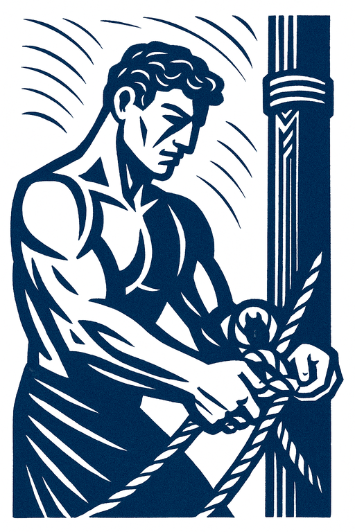

Perimedes
-----------

> They sang these words most musically, and as I longed to hear them
further I made signs by frowning to my men that they should set me free;
but they quickened their stroke, and Eurylochus and **Perimedes bound me
with still stronger bonds till we had got out of hearing of the Sirens'
voices**. Then my men took the wax from their ears and unbound me.

*—[The Odyssee, Book XII](https://www.owleyes.org/text/odyssey/read/book-xii), translation by Samuel Butler*

